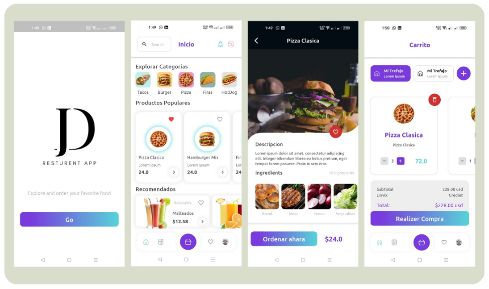

# Resturent App

This is a mobile application that enables users to explore meals and drinks and give them the ability to order whatever they need with a shining UI and animation experiement.

Table of Contents

#### - Features and usage

#### - Technologies used

#### - File Hierarchy

#### - How it looks

#### - How to install

#### - Code Extraction

---

### Features and usage

The app provides a rich set of recommended and popular meals in the home screen giving user ability to favorite any meal or drink.

once the user choose a meal, he/she can see full details of this meal and drop it in the cart or the shopping basket, with a control over the basket and meal numbers.

### - Technologies used

- Dart
- Flutter
- LocalStorage
- - Hive
- Provider
- Clean Architecture

### - File Hierarchy

```
JabalProg
├── assets
│   ├── images
│   │   ├── app
│   │   ├── code
│   │   │   ├── meal_categories
│   │   │   └── ...
│   │   └── icons
│   └── fonts
│       └── ubuntu
└── lib
    ├── core
    │   ├── extensions
    │   └── ...
    ├── features
    │   ├── cart
    │   │   └── presentation
    │   │       ├── controllers
    │   │       ├── screens
    │   │       └── widgets
    │   │           ├── cart_meals
    │   │           ├── top_part
    │   │           └── order_part
    │   ├── home
    │   │   ├── data
    │   │   │   ├── datasource
    │   │   │   ├── models
    │   │   │   └── repositories
    │   │   ├── domain
    │   │   │   ├── entities
    │   │   │   ├── repositories
    │   │   │   └── usecases
    │   │   └── presentation
    │   │       ├── controllers
    │   │       ├── screens
    │   │       └── widgets
    │   │           ├── categories_builder
    │   │           ├── meals_builder
    │   │           ├── drinks_builder
    │   │           └── home_appbar
    │   ├── meal_details
    │   │   ├── screens
    │   │   └── widgets
    │   │       ├── meal_image
    │   │       ├── meal_ingredients
    │   │       └── ...
    │   └── welcome_screen
    │       └── ...
    ├── local_storage
    │   └── hive_facade
    ├── shared
    │   ├── custom_navigation_bar
    │   └── ...
    └── main
```

### - How it looks




you could see screenshots singularly, just go to [screenshots](screenshots) dir.

>For more, watch the following video that demonstrate a walkthrough features of restaurantApp:
>
>[Video Preview](https://www.youtube.com/watch?v=vQa0xmWcf5I)

### - How to install

You should have Flutter SDK installed on your machine, with an IDE:

run this command in your terminal, where you wanna locate this project on your machine

1. ```
         git clone https://github.com/AliEsmaeil/resturentApp
   ```
open the project in your IDE and run the following commands

2. ```
         flutter clean
   ```
3. ```
         flutter pub get
   ```

You are ready, run!

### - Assessment and Code Extraction

This project is part of a task for **JabalProg**. If you're reviewing or assessing the code, you're welcome to explore its implementation.

🔄 Extracting Code

You are allowed to extract and modify the code by forking this repository. Please do so gently and respectfully, ensuring proper attribution when necessary.
